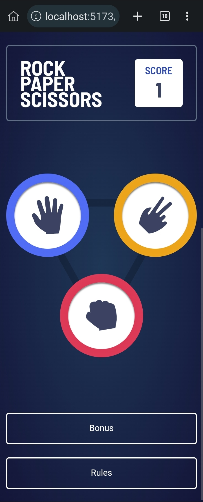

# Frontend Mentor - Rock, Paper, Scissors solution

This is a solution to the [Rock, Paper, Scissors challenge on Frontend Mentor](https://www.frontendmentor.io/challenges/rock-paper-scissors-game-pTgwgvgH). Frontend Mentor challenges help you improve your coding skills by building realistic projects.

## Table of contents

- [Overview](#overview)
  - [The challenge](#the-challenge)
  - [Screenshot](#screenshot)
  - [Links](#links)
- [My process](#my-process)
  - [Built with](#built-with)
  - [What I learned](#what-i-learned)
  - [Continued development](#continued-development)
- [Author](#author)

## Overview

### The challenge

Users should be able to:

- View the optimal layout for the game depending on their device's screen size
- Play Rock, Paper, Scissors against the computer
- Maintain the state of the score after refreshing the browser _(optional)_
- **Bonus**: Play Rock, Paper, Scissors, Lizard, Spock against the computer _(optional)_

### Screenshot

### Links

- Solution URL: [Solution URL here](https://github.com/ezeaniiandrew/rock-paper-scissors)
- Live Site URL: [Live site](https://ezeaniiandrew.github.io/rock-paper-scissors/)

## My process

### Built with

- Semantic HTML5 markup
- CSS custom properties
- Flexbox
- CSS Grid
- Mobile-first workflow
- [React](https://reactjs.org/)

### What I learned

- I learned about how to structure React project properly for easy project
  navigation.
- I learned about SVG's. How to create and animate them as well

### Continued development

- I will be learning more about SVG's
- I will also be learning more about the different methods of structuring a React Project.

## Author

- Website - [Ezeani Andrew](https://github.com/ezeaniiandrew)
- Frontend Mentor - [@Andrew-ezeani](https://www.frontendmentor.io/profile/Andrew-ezeani)
